# AgentStack — Architecture Diagrams

## Diagram 1: System Architecture (High-Level)

```mermaid
%%{init: {'theme':'dark', 'themeVariables': {'primaryColor': '#4f46e5', 'edgeLabelBackground':'#1e1e2e'}}}%%
graph TD
    subgraph UserSpace["🖥️ User Space"]
        A["🤖 Agent Code<br/><i>LangGraph / CrewAI / AutoGen</i>"]
        B["📦 AgentStack SDK<br/><i>@observe decorator</i>"]
    end

    subgraph Ingestion["⚡ Ingestion Layer"]
        C["🔌 Trace Collector<br/><i>FastAPI endpoint</i>"]
    end

    subgraph EventBus["📡 Event Bus"]
        D[("🔴 Redis Streams<br/><i>spans.ingest</i>")]
    end

    subgraph Processing["⚙️ Processing Layer"]
        E["💾 ClickHouse Writer<br/><i>Batch INSERT</i>"]
        F{{"🛡️ Security Engine<br/><i>Threat Scanner</i>"}}
        G["💰 Cost Calculator<br/><i>Token Pricing</i>"]
    end

    subgraph Storage["🗄️ Storage Layer"]
        H[("📊 ClickHouse<br/><i>Columnar DB</i>")]
    end

    subgraph APILayer["🔌 API Layer"]
        I["🌐 FastAPI Server<br/><i>REST + WebSocket</i>"]
    end

    subgraph Frontend["🖼️ Frontend"]
        J["📱 React Dashboard<br/><i>Vite + Shadcn UI</i>"]
    end

    A -->|"function call"| B
    B -->|"OTLP/HTTP<br/>Protobuf + gzip"| C
    C -->|"XADD<br/>MsgPack"| D
    D -->|"XREADGROUP<br/>Consumer: writer"| E
    D -->|"XREADGROUP<br/>Consumer: security"| F
    D -->|"XREADGROUP<br/>Consumer: cost"| G
    E -->|"INSERT<br/>Native Protocol"| H
    F -->|"INSERT alerts<br/>Native Protocol"| H
    G -->|"INSERT metrics<br/>Native Protocol"| H
    H -->|"SELECT<br/>SQL queries"| I
    I -->|"REST/JSON<br/>HTTP/2"| J
    I -.->|"WebSocket/JSON<br/>Live Stream"| J

    classDef userFacing fill:#3b82f6,stroke:#60a5fa,color:#fff,stroke-width:2px
    classDef storage fill:#10b981,stroke:#34d399,color:#fff,stroke-width:2px
    classDef security fill:#ef4444,stroke:#f87171,color:#fff,stroke-width:2px
    classDef async fill:#f59e0b,stroke:#fbbf24,color:#000,stroke-width:2px
    classDef processing fill:#8b5cf6,stroke:#a78bfa,color:#fff,stroke-width:2px

    class A,B,J userFacing
    class H storage
    class F security
    class D async
    class C,E,G,I processing
```

---

## Diagram 2: Data Flow (Sequence)

```mermaid
%%{init: {'theme':'dark', 'themeVariables': {'actorBkg':'#4f46e5','actorTextColor':'#fff','signalColor':'#60a5fa'}}}%%
sequenceDiagram
    autonumber

    actor Dev as 👨‍💻 Developer
    participant SDK as 📦 SDK
    participant Buf as 📋 Batch Queue
    participant Col as 🔌 Collector
    participant Red as 🔴 Redis
    participant CHW as 💾 CH Writer
    participant Sec as 🛡️ Security
    participant CH as 📊 ClickHouse
    participant API as 🌐 FastAPI
    participant UI as 📱 Dashboard

    rect rgb(30, 58, 95)
        Note over Dev,UI: SPAN CREATION
        Dev->>SDK: @observe agent_fn()
        activate SDK
        SDK->>SDK: create span{trace_id, parent_id, timestamps}
        SDK->>SDK: capture{model, tokens, tool, memory}
        SDK-->>Dev: return result (< 5ms overhead)
        deactivate SDK
        SDK->>Buf: enqueue span (async)
    end

    rect rgb(40, 50, 80)
        Note over Buf,Col: BATCH EXPORT
        Note over Buf: Triggers: 64 spans OR 5s timer
        Buf->>Col: POST /v1/traces (OTLP/Protobuf, gzip)
        Col->>Col: validate schema + auth API key
        Col-->>Buf: HTTP 202 Accepted
    end

    rect rgb(50, 40, 70)
        Note over Col,CH: PARALLEL PROCESSING
        Col->>Red: XADD spans.ingest (MsgPack)

        par ClickHouse Writer
            Red->>CHW: XREADGROUP
            CHW->>CH: INSERT INTO spans (batch)
            CHW->>Red: XACK ✓
        and Security Scanner
            Red->>Sec: XREADGROUP
            Sec->>Sec: scan: injection + PII + loops
            alt 🚨 Threat Found
                Sec->>CH: INSERT INTO security_alerts
                Sec->>Red: XADD alerts.live
            end
            Sec->>Red: XACK ✓
        end
    end

    rect rgb(60, 30, 60)
        Note over API,UI: DASHBOARD QUERY
        UI->>API: GET /api/v1/traces?limit=50
        API->>CH: SELECT * FROM spans
        CH-->>API: columnar result set
        API-->>UI: JSON (< 500ms)
    end

    rect rgb(70, 30, 50)
        Note over API,UI: LIVE STREAMING
        UI->>API: WS /ws/traces
        loop Every new span
            Red-->>API: XREAD (tail)
            API-->>UI: push span JSON
        end
    end
```

---

## Diagram 3: SDK Internal Architecture

```mermaid
%%{init: {'theme':'dark'}}%%
graph TD
    subgraph UserCode["👨‍💻 Developer Code"]
        A["@observe<br/>decorator"]
    end

    subgraph SDKCore["📦 SDK Core"]
        B["🔍 Tracer<br/><i>span creation</i>"]
        C["🔗 Context Manager<br/><i>parent/child linking</i>"]
        D["📝 Span Processor<br/><i>enrich + validate</i>"]
    end

    subgraph Enrichment["🧹 Enrichment"]
        E["🧽 PII Sanitizer<br/><i>regex + patterns</i>"]
        F["⚙️ Config Manager<br/><i>env vars + defaults</i>"]
        G["🔌 Framework Hooks<br/><i>auto-instrument</i>"]
    end

    subgraph Export["📤 Export Pipeline"]
        H["📋 Ring Buffer<br/><i>64-span batches</i>"]
        I["⏱️ Flush Timer<br/><i>5-second interval</i>"]
        J["📡 OTLP Exporter<br/><i>HTTP + Protobuf</i>"]
    end

    subgraph Fallback["🔄 Resilience"]
        K["💾 Local Store<br/><i>SQLite fallback</i>"]
        L["🔁 Retry Handler<br/><i>exp. backoff</i>"]
    end

    subgraph Frameworks["🤖 Auto-Instrumentation"]
        M["LangGraph<br/>nodes + edges"]
        N["CrewAI<br/>tasks + agents"]
        O["AutoGen<br/>messages"]
    end

    A -->|"wraps function"| B
    B -->|"propagate ctx"| C
    C -->|"raw span"| D
    D -->|"sanitize"| E
    F -->|"config"| D
    G -->|"hooks"| B
    D -->|"clean span"| H
    I -->|"trigger flush"| H
    H -->|"batch payload"| J
    J -->|"OTLP/HTTP"| External["🔌 Collector"]
    J -.->|"on failure"| L
    L -.->|"retries exhausted"| K
    K -.->|"on reconnect"| J
    M --> G
    N --> G
    O --> G

    classDef user fill:#3b82f6,stroke:#60a5fa,color:#fff,stroke-width:2px
    classDef core fill:#8b5cf6,stroke:#a78bfa,color:#fff,stroke-width:2px
    classDef enrich fill:#06b6d4,stroke:#22d3ee,color:#fff,stroke-width:2px
    classDef export fill:#f59e0b,stroke:#fbbf24,color:#000,stroke-width:2px
    classDef fallback fill:#ef4444,stroke:#f87171,color:#fff,stroke-width:2px
    classDef framework fill:#10b981,stroke:#34d399,color:#fff,stroke-width:2px
    classDef external fill:#6b7280,stroke:#9ca3af,color:#fff,stroke-width:2px

    class A user
    class B,C,D core
    class E,F,G enrich
    class H,I,J export
    class K,L fallback
    class M,N,O framework
    class External external
```

---

## Diagram 4: Storage Layer

```mermaid
%%{init: {'theme':'dark'}}%%
graph TD
    subgraph EventBus["📡 Redis Streams"]
        R[("🔴 spans.ingest<br/><i>maxlen ~1M</i>")]
        RA[("🔴 alerts.live<br/><i>real-time alerts</i>")]
    end

    subgraph Consumers["⚙️ Consumer Groups (Parallel)"]
        C1["💾 ClickHouse Writer<br/><i>batch size: 1000</i><br/><i>flush: 1s</i>"]
        C2{{"🛡️ Security Scanner<br/><i>per-span analysis</i>"}}
        C3["💰 Cost Aggregator<br/><i>per-model pricing</i>"]
    end

    subgraph ClickHouseDB["📊 ClickHouse Cluster"]
        subgraph HotTier["🔥 Hot Storage (7 days)"]
            T1[("spans<br/><i>MergeTree, ORDER BY trace_id</i>")]
            T2[("security_alerts<br/><i>MergeTree, ORDER BY severity</i>")]
            T3[("cost_metrics<br/><i>SummingMergeTree</i>")]
        end
        subgraph ColdTier["❄️ Cold Storage (90 days)"]
            T4[("spans_archive<br/><i>compressed, S3-backed</i>")]
        end
    end

    subgraph Retention["🗑️ Retention Policy"]
        RP["TTL Manager<br/><i>auto-delete > 90 days</i>"]
        MV["Materialized View<br/><i>hot → cold migration</i>"]
    end

    R -->|"XREADGROUP<br/>consumer: writer"| C1
    R -->|"XREADGROUP<br/>consumer: security"| C2
    R -->|"XREADGROUP<br/>consumer: cost"| C3

    C1 -->|"INSERT batch<br/>async_insert=1"| T1
    C2 -->|"INSERT alert"| T2
    C2 -.->|"XADD alert"| RA
    C3 -->|"INSERT metric"| T3

    T1 -->|"after 7 days"| MV
    MV -->|"migrate"| T4
    T4 -->|"after 90 days"| RP

    classDef redis fill:#dc2626,stroke:#f87171,color:#fff,stroke-width:2px
    classDef consumer fill:#8b5cf6,stroke:#a78bfa,color:#fff,stroke-width:2px
    classDef security fill:#ef4444,stroke:#f87171,color:#fff,stroke-width:2px
    classDef hot fill:#f59e0b,stroke:#fbbf24,color:#000,stroke-width:2px
    classDef cold fill:#3b82f6,stroke:#60a5fa,color:#fff,stroke-width:2px
    classDef retention fill:#6b7280,stroke:#9ca3af,color:#fff,stroke-width:2px

    class R,RA redis
    class C1,C3 consumer
    class C2 security
    class T1,T2,T3 hot
    class T4 cold
    class RP,MV retention
```

---

## Diagram 5: Security Engine

```mermaid
%%{init: {'theme':'dark'}}%%
graph TD
    subgraph Input["📥 Input"]
        S["Incoming Span<br/><i>from Redis consumer</i>"]
    end

    subgraph RuleEngine["📏 Rule Engine"]
        R1["🔍 Regex Scanner<br/><i>pattern matching</i>"]
        R2["📋 YARA Rules<br/><i>known attack sigs</i>"]
        R3["📊 Heuristics<br/><i>statistical analysis</i>"]
    end

    subgraph Detectors["🎯 Detection Modules"]
        D1{{"🚨 Prompt Injection<br/><i>'ignore previous'</i><br/><i>'system override'</i><br/><i>role confusion</i>"}}
        D2{{"🔒 PII Leak<br/><i>SSN: XXX-XX-XXXX</i><br/><i>email patterns</i><br/><i>credit card nums</i>"}}
        D3{{"🔄 Anomaly Detection<br/><i>infinite loops</i><br/><i>token explosion</i><br/><i>timeout chains</i>"}}
    end

    subgraph Scoring["⚖️ Threat Scoring"]
        TS["Score Aggregator<br/><i>weighted sum</i>"]
        TH["Threshold Check<br/><i>LOW / MEDIUM / HIGH / CRITICAL</i>"]
    end

    subgraph Output["📤 Output"]
        AL["🔔 Alert Generator<br/><i>structured alert object</i>"]
        DB[("📊 ClickHouse<br/><i>security_alerts table</i>")]
        RT[("🔴 Redis<br/><i>alerts.live stream</i>")]
        WH["🌐 Webhook<br/><i>Slack / PagerDuty</i>"]
    end

    S --> R1
    S --> R2
    S --> R3

    R1 --> D1
    R1 --> D2
    R2 --> D1
    R3 --> D3

    D1 -->|"score: 0-100"| TS
    D2 -->|"score: 0-100"| TS
    D3 -->|"score: 0-100"| TS

    TS --> TH

    TH -->|"≥ 30: alert"| AL
    AL -->|"INSERT"| DB
    AL -->|"XADD"| RT
    AL -.->|"POST /webhook"| WH

    classDef input fill:#3b82f6,stroke:#60a5fa,color:#fff,stroke-width:2px
    classDef rules fill:#8b5cf6,stroke:#a78bfa,color:#fff,stroke-width:2px
    classDef detect fill:#ef4444,stroke:#f87171,color:#fff,stroke-width:2px
    classDef scoring fill:#f59e0b,stroke:#fbbf24,color:#000,stroke-width:2px
    classDef output fill:#10b981,stroke:#34d399,color:#fff,stroke-width:2px

    class S input
    class R1,R2,R3 rules
    class D1,D2,D3 detect
    class TS,TH scoring
    class AL,DB,RT,WH output
```

---

## Diagram 6: Deployment (Docker Compose)

```mermaid
%%{init: {'theme':'dark'}}%%
graph TD
    subgraph DockerNetwork["🐳 Docker Network: agentstack-net"]

        subgraph PublicFacing["🌍 Public (ports exposed)"]
            NGINX["🔒 Nginx<br/><i>:80 → :443</i><br/><i>TLS termination</i>"]
        end

        subgraph Services["⚙️ Application Services"]
            COL["🔌 Collector<br/><i>:4318 (internal)</i><br/><i>2 replicas</i>"]
            API["🌐 API Server<br/><i>:8000 (internal)</i><br/><i>2 replicas</i>"]
            DASH["📱 Dashboard<br/><i>:3000 (internal)</i><br/><i>static files</i>"]
        end

        subgraph Workers["👷 Background Workers"]
            W1["💾 CH Writer<br/><i>1 replica</i>"]
            W2{{"🛡️ Security<br/><i>1 replica</i>"}}
            W3["💰 Cost Calc<br/><i>1 replica</i>"]
        end

        subgraph DataStores["💾 Data Stores"]
            RED[("🔴 Redis<br/><i>:6379</i><br/><i>vol: redis-data</i>")]
            CH[("📊 ClickHouse<br/><i>:8123 / :9000</i><br/><i>vol: ch-data</i>")]
        end
    end

    subgraph Volumes["📁 Docker Volumes"]
        V1["redis-data<br/><i>AOF persistence</i>"]
        V2["ch-data<br/><i>MergeTree storage</i>"]
        V3["nginx-certs<br/><i>TLS certificates</i>"]
    end

    Internet["☁️ Internet"] -->|":443 HTTPS"| NGINX
    NGINX -->|"/api/* → :8000"| API
    NGINX -->|"/ → :3000"| DASH
    NGINX -->|"/v1/traces → :4318"| COL

    COL -->|"XADD"| RED
    RED -->|"XREADGROUP"| W1
    RED -->|"XREADGROUP"| W2
    RED -->|"XREADGROUP"| W3
    W1 -->|"INSERT"| CH
    W2 -->|"INSERT"| CH
    W3 -->|"INSERT"| CH
    API -->|"SELECT"| CH
    API -.->|"XREAD"| RED

    RED ~~~ V1
    CH ~~~ V2
    NGINX ~~~ V3

    classDef public fill:#3b82f6,stroke:#60a5fa,color:#fff,stroke-width:2px
    classDef service fill:#8b5cf6,stroke:#a78bfa,color:#fff,stroke-width:2px
    classDef worker fill:#f59e0b,stroke:#fbbf24,color:#000,stroke-width:2px
    classDef security fill:#ef4444,stroke:#f87171,color:#fff,stroke-width:2px
    classDef store fill:#10b981,stroke:#34d399,color:#fff,stroke-width:2px
    classDef volume fill:#6b7280,stroke:#9ca3af,color:#fff,stroke-width:2px
    classDef external fill:#1e1e2e,stroke:#fff,color:#fff,stroke-width:1px

    class NGINX public
    class COL,API,DASH service
    class W1,W3 worker
    class W2 security
    class RED,CH store
    class V1,V2,V3 volume
    class Internet external
```

---

## Diagram 7: Scaling Evolution

```mermaid
%%{init: {'theme':'dark'}}%%
graph LR
    subgraph Stage1["🧪 Stage 1: Solo Dev<br/><i>0 - 10 spans/sec</i>"]
        S1A["📦 SDK"] --> S1B["💾 SQLite<br/><i>local file</i>"]
        S1B --> S1C["🖥️ CLI Viewer<br/><i>rich terminal</i>"]
    end

    subgraph Stage2["👥 Stage 2: Small Team<br/><i>10 - 1K spans/sec</i>"]
        S2A["📦 SDK"] -->|"HTTP"| S2B["🌐 FastAPI<br/><i>single server</i>"]
        S2B --> S2C[("💾 SQLite<br/><i>server-side</i>")]
        S2B --> S2D["📱 React<br/><i>dashboard</i>"]
    end

    subgraph Stage3["🏢 Stage 3: Production<br/><i>1K - 100K spans/sec</i>"]
        S3A["📦 SDK"] -->|"OTLP"| S3B["⚖️ Load<br/>Balancer"]
        S3B --> S3C["🔌 Collector<br/><i>x2 replicas</i>"]
        S3C --> S3D[("🔴 Redis<br/><i>Streams</i>")]
        S3D --> S3E["💾 CH Writer"]
        S3D --> S3F{{"🛡️ Security"}}
        S3E --> S3G[("📊 ClickHouse<br/><i>cluster</i>")]
        S3F --> S3G
        S3G --> S3H["🌐 API<br/><i>x2 replicas</i>"]
        S3H --> S3I["📱 Dashboard<br/><i>CDN</i>"]
    end

    Stage1 -.->|"add server<br/>+ dashboard"| Stage2
    Stage2 -.->|"add Redis<br/>+ ClickHouse<br/>+ workers"| Stage3

    classDef stage1 fill:#06b6d4,stroke:#22d3ee,color:#fff,stroke-width:2px
    classDef stage2 fill:#8b5cf6,stroke:#a78bfa,color:#fff,stroke-width:2px
    classDef stage3 fill:#f59e0b,stroke:#fbbf24,color:#000,stroke-width:2px
    classDef security fill:#ef4444,stroke:#f87171,color:#fff,stroke-width:2px

    class S1A,S1B,S1C stage1
    class S2A,S2B,S2C,S2D stage2
    class S3A,S3B,S3C,S3D,S3E,S3G,S3H,S3I stage3
    class S3F security
```

