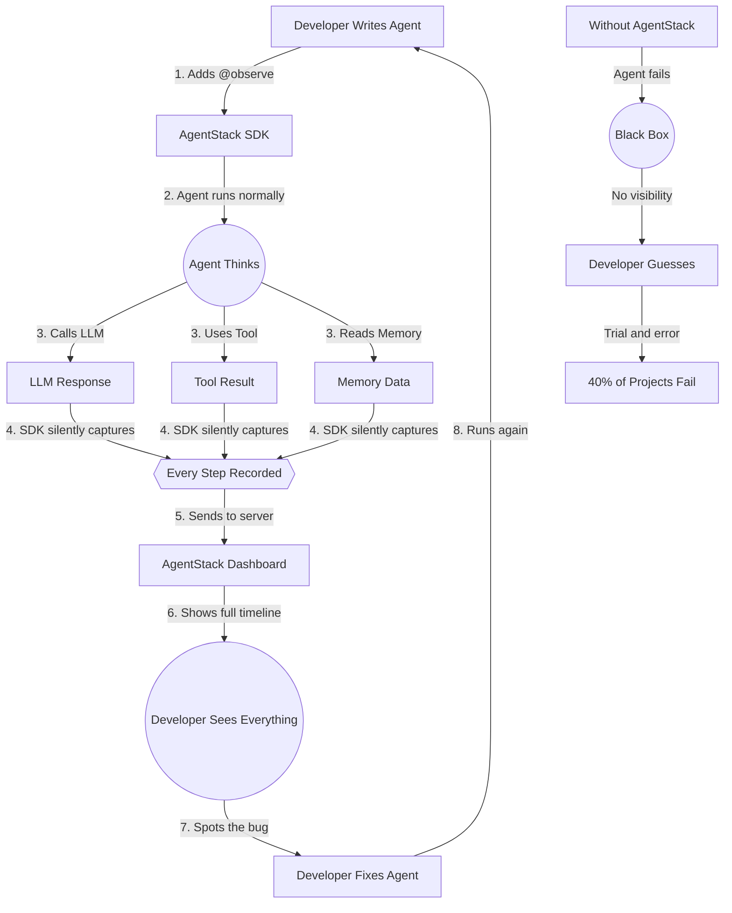
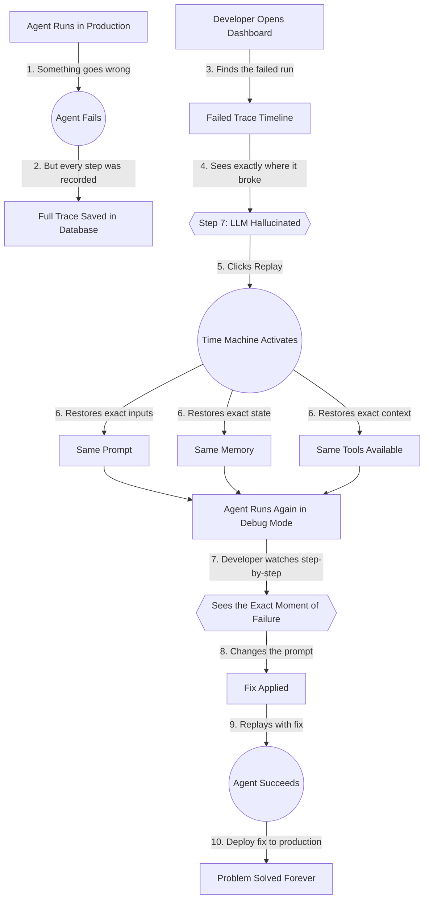
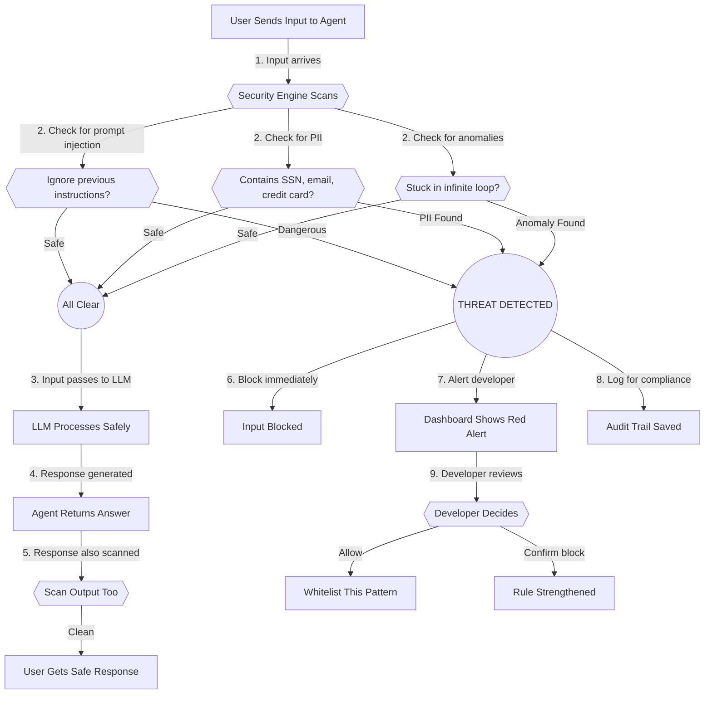

# AgentStack — Logic Flowcharts

## Chart 1: The Magic (How It Works)

```mermaid
graph TD
    A[Developer Writes Agent] -->|1. Adds @observe| B[AgentStack SDK]
    B -->|2. Agent runs normally| C((Agent Thinks))
    C -->|3. Calls LLM| D[LLM Response]
    C -->|3. Uses Tool| E[Tool Result]
    C -->|3. Reads Memory| F[Memory Data]
    D -->|4. SDK silently captures| G{{Every Step Recorded}}
    E -->|4. SDK silently captures| G
    F -->|4. SDK silently captures| G
    G -->|5. Sends to server| H[AgentStack Dashboard]
    H -->|6. Shows full timeline| I((Developer Sees Everything))
    I -->|7. Spots the bug| J[Developer Fixes Agent]
    J -->|8. Runs again| A

    K[Without AgentStack] -->|Agent fails| L((Black Box))
    L -->|No visibility| M[Developer Guesses]
    M -->|Trial and error| N[40% of Projects Fail]
```

---

## Chart 2: The Time Machine (Replay Feature)

```mermaid
graph TD
    A[Agent Runs in Production] -->|1. Something goes wrong| B((Agent Fails))
    B -->|2. But every step was recorded| C[Full Trace Saved in Database]

    D[Developer Opens Dashboard] -->|3. Finds the failed run| E[Failed Trace Timeline]
    E -->|4. Sees exactly where it broke| F{{Step 7: LLM Hallucinated}}

    F -->|5. Clicks Replay| G((Time Machine Activates))
    G -->|6. Restores exact inputs| H[Same Prompt]
    G -->|6. Restores exact state| I[Same Memory]
    G -->|6. Restores exact context| J[Same Tools Available]

    H --> K[Agent Runs Again in Debug Mode]
    I --> K
    J --> K

    K -->|7. Developer watches step-by-step| L{{Sees the Exact Moment of Failure}}
    L -->|8. Changes the prompt| M[Fix Applied]
    M -->|9. Replays with fix| N((Agent Succeeds))
    N -->|10. Deploy fix to production| O[Problem Solved Forever]
```

---

## Chart 3: The Shield (Security Feature)

```mermaid
graph TD
    A[User Sends Input to Agent] -->|1. Input arrives| B{{Security Engine Scans}}

    B -->|2. Check for prompt injection| C{{"Ignore previous instructions?"}}
    B -->|2. Check for PII| D{{"Contains SSN, email, credit card?"}}
    B -->|2. Check for anomalies| E{{"Stuck in infinite loop?"}}

    C -->|Safe| F((All Clear))
    D -->|Safe| F
    E -->|Safe| F

    F -->|3. Input passes to LLM| G[LLM Processes Safely]
    G -->|4. Response generated| H[Agent Returns Answer]
    H -->|5. Response also scanned| B2{{Scan Output Too}}
    B2 -->|Clean| I[User Gets Safe Response]

    C -->|Dangerous| J((THREAT DETECTED))
    D -->|PII Found| J
    E -->|Anomaly Found| J

    J -->|6. Block immediately| K[Input Blocked]
    J -->|7. Alert developer| L[Dashboard Shows Red Alert]
    J -->|8. Log for compliance| M[Audit Trail Saved]
    L -->|9. Developer reviews| N{{Developer Decides}}
    N -->|Allow| O[Whitelist This Pattern]
    N -->|Confirm block| P[Rule Strengthened]
```
